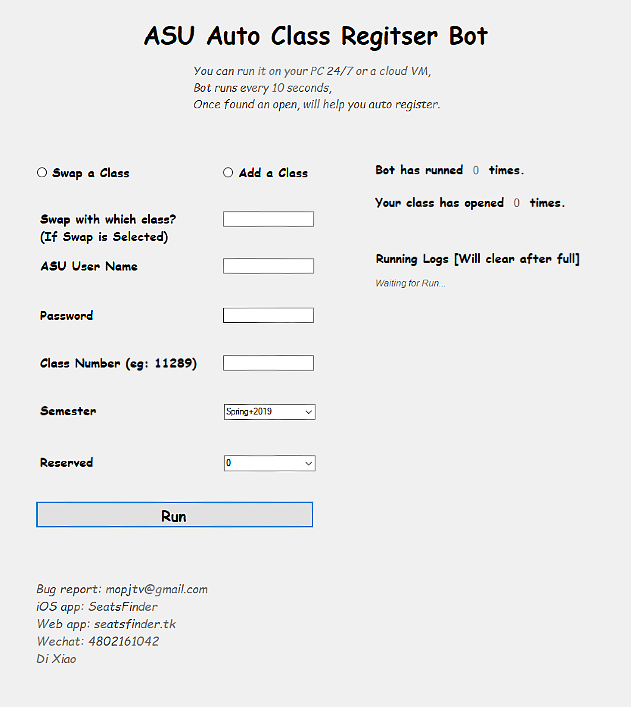

## ASU Class Register Bot 

#### System Requirement
* Windows 10

#### How it works
* Bot runs every 10 seconds by regularly checking ***_[https://webapp4.asu.edu/catalog](https://webapp4.asu.edu/catalog)_*** 

#### How to use
* ***_First_***, you will need a KEY to get access. 
* Download the repository to your ***_Windows_*** computer.
* Open ***SeatsFinderBot.exe*** [Open it in folder, don't move it out].
* Enter the required options.
* You can open either on your local PC or put it in a cloud VM so that you don't have to shut down your computer.
* Enjoy!

#### My Other Apps [Same Functions But in Different Platforms]
* iOS App: **_*[SeatsFinder](https://itunes.apple.com/us/app/seatsfinder/id1111929351?mt=8)*_** 
* Web App: ***_[seatsfinder.tk](http://www.seatsfinder.tk/)_*** 
